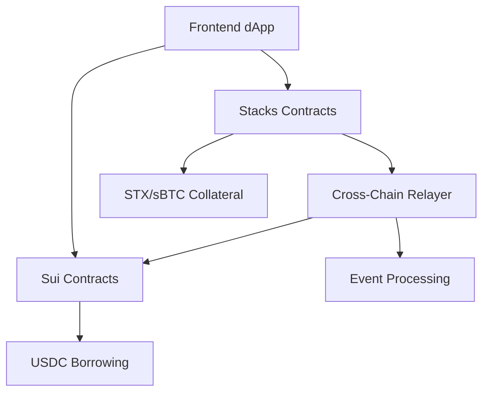

# Hayy Protocol👋

**Cross-Chain Money Market between Stacks and Sui Blockchain**

Hayy Protocol is a revolutionary decentralized finance (DeFi) protocol that enables seamless cross-chain lending by using STX or sBTC as collateral on Stacks L2 blockchain to borrow tokens on Sui blockchain. The protocol bridges Bitcoin's security through Stacks with Sui's high-performance blockchain.

## 🌟 Features

- **Cross-Chain Lending**: Use STX or sBTC as collateral to borrow USDC on Sui blockchain
- **Stacks Integration**: Leverage Bitcoin's security through Stacks L2 blockchain
- **Sui Integration**: High-performance blockchain with low transaction fees for borrowing
- **Real-Time Relayer**: Automated cross-chain transaction processing
- **User-Friendly Interface**: Modern React frontend with wallet integration
- **Secure Smart Contracts**: Audited and battle-tested contract architecture
- **EVM Support**: Coming soon - will enable borrowing on EVM-compatible networks

## 🏗️ Architecture

The protocol consists of four main components:



### Components

1. **Frontend (`hayyprotocol-fe`)**: React-based user interface with Stacks and Sui wallet integration
2. **Stacks Contracts (`hayyprotocol-stacks`)**: Clarity smart contracts for collateral management
3. **Sui Contracts (`hayyprotocol-sui`)**: Move smart contracts for token borrowing and lending
4. **Backend/Relayer (`hayyprotocol-backend`)**: Node.js service for cross-chain event processing

## 📋 Contract Addresses

### Stacks Testnet

| Contract | Address |
|----------|---------|
| **Money Market Core** | `STBGS8Y6KHWQ3D2P9BTQ83VBD3ZCK7BDTWMGJY5Z.collateral-v1` |

### Sui Testnet

| Contract | Address | Explorer |
|----------|---------|----------|
| **USDC Lending Pool** | `Coming Soon` | [View on Sui Explorer](https://testnet.suivision.xyz/package/0xf13ad32a2d462fd5afebf3a844a437b7b97046ebb1d181782b2f11216213ecca) |
| **sBTC Lending Pool** | `Coming Soon` | [View on Sui Explorer](https://testnet.suivision.xyz/object/) |
| **Borrow Controller** | `Coming Soon` | [View on Sui Explorer](https://testnet.suivision.xyz/object/) |

## 🔗 Explorer Links

- **Stacks Testnet Collateral-V1**: [Stacks Explorer](https://explorer.hiro.so/txid/STBGS8Y6KHWQ3D2P9BTQ83VBD3ZCK7BDTWMGJY5Z.collateral-v1?chain=testnet)
- **Stacks Testnet Lending-V1**: [Stacks Explorer](https://explorer.hiro.so/txid/STBGS8Y6KHWQ3D2P9BTQ83VBD3ZCK7BDTWMGJY5Z.lending-v1?chain=testnet)
- **Sui Testnet**: [Sui Explorer](https://explorer.sui.io/)

## 🚀 Quick Start

### Prerequisites

- Node.js 18+ and npm/pnpm
- Git
- Stacks wallet (Hiro Wallet, Leather, etc.)
- Sui wallet (Sui Wallet, Suiet, etc.)

### Installation

1. **Clone the repository**
   ```bash
   git clone https://github.com/xfajarr/hayy-protocol.git
   cd hayy-protocol
   ```

2. **Install dependencies for each component**
   ```bash
   # Frontend
   cd hayyprotocol-fe
   npm install
   
   # Backend/Relayer
   cd ../hayyprotocol-backend
   npm install
   
   # Stacks contracts (optional, for development)
   cd ../hayyprotocol-stacks
   npm install
   
   # Sui contracts (optional, for development)
   cd ../hayyprotocol-sui
   npm install
   ```

3. **Configure environment variables**
   ```bash
   # In hayyprotocol-backend/
   cp .env.example .env
   # Edit .env with your RPC URLs and private keys
   ```

4. **Start the development servers**
   ```bash
   # Terminal 1: Start backend/relayer
   cd hayyprotocol-backend
   npm start
   
   # Terminal 2: Start frontend
   cd hayyprotocol-fe
   npm run dev
   ```

5. **Access the application**
   - Frontend: http://localhost:5173
   - Backend API: http://localhost:3000

## 💡 How It Works

1. **Deposit Collateral**: Users deposit STX or sBTC tokens as collateral on Stacks blockchain
2. **Request Borrow**: Users specify the amount of USDC they want to borrow on Sui blockchain
3. **Cross-Chain Processing**: The relayer monitors Stacks events and processes requests
4. **Token Minting**: Sui contracts mint/transfer requested USDC to user's Sui address
5. **Repayment**: Users repay borrowed USDC on Sui to unlock their STX/sBTC collateral

## 🛠️ Development

### Frontend Development

```bash
cd hayyprotocol-fe
npm run dev        # Start development server
npm run build      # Build for production
npm run lint       # Run linting
```

### Smart Contract Development

**Stacks Contracts:**
```bash
cd hayyprotocol-stacks
clarinet check     # Check contract syntax
clarinet test      # Run tests
clarinet deploy    # Deploy to testnet
```

**Sui Contracts:**
```bash
cd hayyprotocol-sui
sui move build     # Build contracts
sui client test    # Run tests
sui client publish  # Deploy to testnet
```

### Backend/Relayer Development

```bash
cd hayyprotocol-backend
npm run dev        # Start with hot reload
npm test           # Run tests
npm run docker     # Build Docker image
```

## 🧪 Testing

### Test on Testnets

1. **Get Testnet Tokens**
   - STX: [Stacks Testnet Faucet](https://explorer.hiro.so/sandbox/faucet?chain=testnet)
   - SUI: [Sui Testnet Faucet](https://faucet.sui.io/)

2. **Connect Wallets**
   - Configure Stacks wallet for testnet
   - Configure Sui wallet for testnet

3. **Test Flow**
   - Deposit STX or sBTC collateral on Stacks
   - Request USDC borrow on Sui
   - Verify USDC receipt on Sui
   - Test repayment flow

## 📚 Documentation

- [Frontend Integration Guide](./hayyprotocol-fe/README.md)
- [Stacks Contract Documentation](./hayyprotocol-stacks/README.md)
- [Sui Contract Documentation](./hayyprotocol-sui/README.md)
- [Backend Setup Guide](./hayyprotocol-backend/README.md)

## 📄 License

This project is licensed under the MIT License - see the [LICENSE](LICENSE) file for details.

## 🌐 Links

- **Website**: [Coming Soon]

---

**⚠️ Disclaimer**: This protocol is currently in testnet phase. Use at your own risk and never deposit more than you can afford to lose. Always verify contract addresses before interacting with the protocol.
